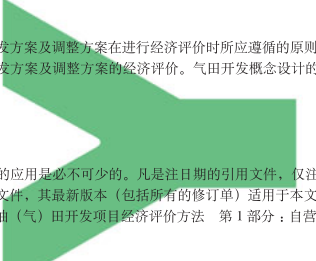

# 高温高压钻井关键技术发展现状及展望

罗鸣1, 2,冯永存1*,桂云1,邓金根1,韩城2 1 中国石油大学(北京)石油工程学院,北京 102249 2 中海石油(中国)有限公司湛江分公司,湛江 524057 * 通信作者:yfeng@cup.edu.cn 收稿日期: 2020-07-13 中国石油大学( 北京) 科研基金(2462019YJRC008) 和国家自然科学基金面上项目(52074312) 联合资助 摘要 随着我国对深层油气资源需求的不断增长,在勘探开发过程中,高温高压地层变的越来越常见,给钻井 带来了诸多困难与挑战。高温高压钻井除了要面临高温高压的挑战,还要克服地层压力预测难、井身结构复杂、
井控难、钻井液流变性差、机械钻速低、井下工具适应性差等一系列的问题。通过对国内外高温高压钻井技术 文献的整理,从地层压力预测、井身结构优化、控压钻井、抗高温钻井液、钻头与高效破岩、随钻测量与导向 工具等 6 个方面对目前高温高压钻井技术的发展进行了总结,并对各个方面的发展做了一定的展望。目前,国 内外高温高压钻井关键技术中,高温是最急需解决的问题。对于国内来说,井下 175 ℃是一个坎,许多国内的 钻井设备与技术在面临这个温度时都会产生一系列问题,因此,也限制了国内技术的规模化应用,而且与国 外的先进水平相比,尚有一定差距。国外高温高压钻井关键技术主要集中在Schlumberger、Halliburton、Baker Hughes、Weatherford等主要石油工程技术公司中,且都已经形成了自己的特色系列产品并进行过一定规模的应 用。例如斯伦贝谢公司的自动节流控压钻井系统、威德福公司和雪弗龙公司合作开发的随钻测井技术服务HEX
等。总的来说,过去几年高温高压钻井技术得到了快速的发展,取得了很大的成就;但如何实现高温高压井安 全高效的钻进,仍是国内外共同需要努力的方向,而且对于高温高压非常规井的钻井技术研究也十分缺乏。因 此,国内外仍要加大对高温高压钻井技术的研究力度,特别是国内,应继续跟踪加强研究,以满足日益苛刻的 钻井需求。虽然目前的技术能力并不能解决所有问题,但是为今后高温高压钻井技术的发展奠定了良好的基础。

关键词 钻井技术;高温高压;深层;发展现状;发展展望

## Development Status And Prospect Of Key Technologies For High Temperature And High Pressure Drilling

LUO Ming1, 2, FENG Yongcun1, GUI Yun1, DENG Jingen1, HAN Cheng2 1 College of Petroleum Engineering, China University of Petroleum-Beijing, Beijing 102249, China 2 CNOOC China Limited Zhanjiang Branch, Zhanjiang 524057, China Abstract With the increasing demand for deep oil and gas resources in China, drilling in high temperature and high pressure (HTHP) formations is becoming more and more common in the process of exploration and development, which leads to many difficulties and challenges for the drilling industry. In addition to the challenges of high temperature and high pressure, HTHP 
引用格式:罗鸣, 冯永存, 桂云, 邓金根, 韩城. 高温高压钻井关键技术发展现状及展望. 石油科学通报, 2021, 02: 228-244 LUO Ming, FENG Yongcun, GUI Yun, DENG Jingen, HAN Cheng. Development status and prospect of key technologies for high temperature and high pressure drilling. Petroleum Science Bulletin, 2021, 02: 228-244. doi: 10.3969/j.issn.2096-1693.2021.02.018 drilling must overcome a series of problems, such as difficult formation pressure prediction, complex well structures, difficult well control, poor rheology of drilling fluids, low rate of penetration (ROP) and lack of capable downhole tools. Based on a literature review of HTHP drilling technology at home and abroad, this paper summarizes the development of HTHP drilling technology from six aspects. These are: formation pressure prediction, wellbore structure optimization, pressure control drilling, high temperature resistant drilling fluid, bit and efficient rock breaking, MWD and steering tools. This provides a possibility for the development of various improvements. At present, high temperature is the most challenging problem in the key technologies of high temperature and high pressure drilling at home and abroad. For China, a downhole temperature of 175 ℃ is a barrier. Much domestic drilling equipment and technologies will have a series of problems when facing this temperature. Therefore, large-scale applications of domestic technology are limited, and there is still a gap compared with the advanced levels in foreign countries. The key technologies of HTHP drilling abroad were mainly developed by the petroleum engineering technology companies such as Schlumberger, Halliburton, Baker Hughes, and Weatherford. In these companies, series of products with their own characteristics have been developed and used widely, for example, Schlumberger's managed pressure drilling system and the logging while drilling technology HEX codeveloped by Weatherford and Chevron. In general, HTHP drilling technologies have been developing rapidly in the past few years and made great progress. However, achieving safe and efficient drilling of HTHP 
wells is still the common direction of efforts at home and abroad, and research into drilling technology of HTHP unconventional wells is rare. Therefore, research on HTHP drilling technology should be further strengthened. In particular, China should continue to follow up and strengthen research to meet the increasing drilling needs. Although the current technical ability cannot solve all the HTHP drilling problems, it has laid a good foundation for the development of new HTHP drilling technology in the future.

Keywords drilling technology; HTHP; deep formation; development status; prospects doi: 10.3969/j.issn.2096-1693.2021.02.018

## 0 前 言

高温高压井在国外称为HTHP井,根据国际HTHP
合作促进协会的规定,地层温度达到 300 ºF(149 ℃), 地层压力达到 15 000 psi(103.4 MPa)或井口压力达到 10 000 psi(68.9 MPa)以上的井称为高温高压井[1]。然 而,不同组织和公司对高温高压井也有不同的定义, 图 1 为斯伦贝谢、贝克休斯和哈里伯顿 3 大油田服务 公司对高温高压、超高温高压和特高温高压门限值的

## 定义。

随着油气开发技术的进步,越来越多的高温高压 油田被发现,如中国南海莺歌盆地,马来西亚浅海, 印度东海岸的Krishna Godavary盆地和南德克萨斯盆地 等[2]。高温高压油气田开发过程中面临一系列的钻井 问题,严重制约着油气田的安全高效开发。为了保障 高温高压环境下钻井作业的安全高效进行,这些油田、
区块需要更完善的钻井技术与配套工艺,这为国内外 高温高压钻井技术的发展带来了更多的机遇与挑战。

ᅯ߈ࢸQTJ
本文对国内外高温高压钻井技术文献进行了整理, 从地层压力预测、井身结构设计、控压钻井、抗高温 钻井液、高效破岩、测量与导向工具等 6 个方面对目 前高温高压钻井技术的发展进行了总结,并对各个方 面的发展做了一定的展望。

## 1 **高温高压钻井面临的技术挑战**

与常规的钻井作业不同,高温高压环境下的钻井 作业,不仅具有高度的复杂性与危险性,还对钻井技 术、设备、工具与工艺等提出了更严苛的要求。

(1)地层压力预测 高温高压钻井要面对地层压力变化规律难以掌握 以及由于地层压力预测不准造成的井壁失稳、井下复 杂情况等问题。目前的地层压力预测技术中,地震数 据处理技术相对粗糙,数据分辨率的准确性较低,预 测精度无法满足安全钻进的需求。这不仅导致了钻井 的危险性大大增加,还增加了相当程度的经济损失。 特别是深井钻探中窄密度窗口钻井问题最为复杂,对 地层压力的认识程度要求会更高。

(2)井身结构 大部分的高温高压井井身结构比较复杂,因此常 会使用非标准的井眼尺寸配合标准尺寸的套管,套管 与环空的间隙小,不利于维持井壁稳定。另外,因为 高温高压井通常较深,传统自下而上的井身结构设计 方法已不能满足需求。

(3)控压钻井 高温高压钻井的压力控制与窄密度窗口作业是一 个十分巨大的挑战。钻井过程中井下压力的控制对储 层保护、防止钻井液污染地层、减小井底正表皮系数、 维持井壁稳定等非常重要。窄密度窗口需要更为先进 的控压钻井技术,通过控制井口回压等措施,准确地 调节井底压力,控制环空压力和当量循环密度。

(4)抗高温钻井液 温度对水基钻井液的影响非常大,超过 150 ℃时 大多数聚合物处理剂易分解或降解,或出现高温交联 现象,引起增稠、胶凝、固化成型或减稠等流变性恶 化问题,造成钻井液体系的不稳定性。因此高温高压 钻井液的技术难点体现在:钻井液处理剂在高温高压 下失效、钻井液高温流变性的控制、高温滤失造壁性 的控制、抗高温钻井液的护胶、高温高压条件下防漏 堵漏材料选择、高温高压条件下钻井液的润滑性问题 以及高密度的钻井液的维护等问题[3]。

(5)高效破岩 随着温度的升高,岩石的性质会发生很大的变化, 例如强度降低、塑性增强、可钻性等级发生变化。同 时,高温对钻进系统也会产生很大影响,例如钻井液 携岩能力降低、钻头磨损加剧等[4]。高温地层中的钻 进会加剧钻头的磨损,大大降低钻头的使用寿命,同 时也影响了机械钻速。因此高温高压地层中往往会面 临着地层可钻性等级低、钻头使用寿命低、机械钻速 低、经济效益低等困境。

(6)测量与导向工具 高温高压井的井深普遍在 5000 m以上,因此对随 钻测量工具和导向工具的工作能力,尤其是耐温和耐 压能力要求很高。由于井比较深,所以易产生井斜, 导致井眼偏离设计轨迹,工具就可能因为井斜超过允 许范围而无法正常运行,进而产生不必要的损失。再 加上高温高压井地下环境复杂,较普通井更易造成井 壁坍塌、卡钻,固井窜槽、管外冒油气等问题。因此, 高温高压井中测量与导向工具的安全、正常、精确的 运行,就显得十分重要。

## 2 **高温高压钻井关键技术发展现状** 2.1 地层压力预测技术

目前,关于高温高压地层压力预测方法主要有地 震法、三维地质应力分析法、Eaton法、磁测法、速 度差法等方法。近几年在国外,除了常规的地层压 力预测方法外,随钻压力监测也得到了越来越多的重 视。比如,Geoservices公司研发了一种可对高温高压 井进行现场地层压力随钻监测的EquiPoise系统,科研 人员根据地层压力监测的实际结果来修正地层压力预 测模型,进而对钻头以下 100~300 m深度的地层压力 剖面进行实时预测。在中海油湛江分公司的钻后实测 压力验证表明,该方法地层孔隙压力预测精度达到了 94%[5]。

另外,一些国外学者还提出了考虑多种因素进行 地层压力预测与分析的新方法。比如,澳大利亚研究 人员通过对伊朗某油田碳酸盐岩储层的研究,利用储 层的压缩性来预测孔隙压力,即当地层被压实时,孔 隙空间减小,会对填充孔隙的流体施加压力,从而建 立了孔隙流体压力产生机制,并尝试了碳酸盐岩孔隙 压力预测的新方法。Stephen等人基于泊松比和杨氏模 量(地震推导),结合地震反演,得到孔隙度分布和压 缩性的信息,然后将其与孔隙压力联系起来,进而为 远程压力的预测提供了可能性等等。Dutta在研究中将 地层压力看作是页岩比率、温度和成岩作用的函数, 通过建立它们之间的关系来预测孔隙压力。Lee等人在 研究中将地层异常高压作为孔隙度和水深的函数建立 起一个新的异常压力预测模型[6-8]。这些方法虽然对施 工有一定的指导作用,但也有一定的局限性,并不能 完全满足深部高温高压地层压力预测的需求。

国内的高温高压井地层压力预测技术多是建立在 基于地震和测井数据的常规方法,同时也借鉴了国外 的一些新技术。近些年,针对南海西部莺歌海盆地和 塔里木盆地等高温高压含油气地层的孔隙压力研究, 促进了我国高温高压孔隙压力预测技术的进步。比较 有代表性的是,蔡军等人改变传统的单井点地层压力 预测模式,从三维地质模型的建立出发,引入三维地 质应力模拟方法,为待钻井提供精确地层压力剖面[9]。

樊建华等基于叠加速度的约束反演获得背景层速度, 再以叠后波阻抗反演获得目的层精确的层速度,然后 采用Fillippone公式直接由地震速度计算得到地层压 力,有效提高了地层压力预测的精度和可靠性[10]。罗 鸣等人研发了深度卡层与智能预警技术和随钻VSP技 术,可实时更新钻头在地震剖面中的位置和钻头前方 高压层的位置,为准确确定套管下入深度、反演下部 层位深度及压力提供参考。还有一些国内学者改进了 国内外的传统地层压力预测公式,并且结合地区的具 体情况,综合利用多种预测技术,提出了高温超压地 层孔隙压力预测的新思路[11-14]。

近几年,面对中国石油资源劣质化和油气勘探开 发对象逐渐复杂化的问题,地质工程一体化技术体系 在国内得到快速发展[15]。地质工程一体化技术是将地 质研究、工程设计和现场实施组织纳入一体化协作体 系,解决工程难题。关键技术主要包括科学化的工作 机制流程、井位和井轨迹优化技术、钻前压力预测技 术、井壁稳定性预测技术和完井改造优化技术等[16]。

目前该技术已得到成功应用,例如在中国南海西部高 温高压井(目的层埋深超过 4000 m,地层压力系数大 于 2.2,温度在 200 ℃左右)地质作业及钻井工程中得 到了成功应用,地质作业成功率由 85%提高至 100%,
钻井作业复杂情况下降 60%,不仅降本增效成果显著, 而且大大提高了钻井效率[17];塔里木油田的克深储层 是致密气砂岩储层,在高构造应力下,储层压力超过 110 MPa,温度高达 165 ℃,为了更好得到克深储层力 学性质和地应力的关键信息,根据KS205 和KS207 井 的岩芯,以及 15 口井的测井数据建立了综合地质力 学评价系统,为增产人员提供了可靠的信息[18]。在未 来,日益复杂的油气藏勘探开发需要地质工程一体化 这一理念及方法,要不断加强创新与尝试,开发出针 对不同油气藏的地质工程一体化技术体系。

在与地层压力密切相关的井壁稳定性方面,井漏 是高温高压钻井面临的最为突出的井壁稳定性问题。 在井漏预测与控制方面,众多学者通过综合分析漏失 层的影响因素,预测可能发生漏失的地层层位,进而 从合理井身结构、钻井液密度、类型、配方、性能及 钻井工程技术措施等方面预防漏失的发生[19]。例如, 中石化针对沙特B区块高温高压气井漏失情况设计了 相关的配套钻井技术,包括井身结构优化、钻头评价 与优选、复合钻进、加强防漏堵漏、应用MPD钻井 技术等[20];针对塔中区块碳酸盐岩缝洞型异常高温高 压储集层,研究人员研发了一种新型的抗高温高承压 的复合堵漏材料SXM-I,所形成的堵漏钻井液抗温达 到了 180 ℃以上,新配制的堵漏钻井液体系对裂缝和 孔洞均具有较好的封堵效果,裂缝封堵承压 9 MPa以 上;针对南海西部高温高压油气田,研究人员研发了 高温高压井高密度钻井液堵漏技术,并进一步优化了 堵漏钻井液体系,优化前后的堵漏钻井液黏度变化不 大,但钻井液API滤失量降低[21]。近年来,有学者又 提出了包括智能形状记忆合金、智能形状记忆聚合物、
智能凝胶、智能膜和智能仿生材料等智能型材料在复 杂地层中的应用,可显著提高堵漏效率,但总体仍处 于起步阶段,未来仍需制定科学化和智能化的堵漏工 艺,推动钻井液防漏堵漏技术的实用性、创新性和智 能化发展,使之能更好地应用于高温高压等复杂环境 中[22]。

在国外,Dasgupta等人开发的新型耐高温分散纤 维堵漏体系,软化点和熔点在 200 ℃以上,在印度 东部油田和西部海上油田得到了推广应用[23]。Baker Hughes开发的抗高温高压堵漏体系S-II,室内实验抗 温达 204 ℃,室内试验显示,新的堵漏体系在 100 psi 的压差下,能更有效地密封 200 目砂层;在现场应用 过程中,表现出优良的兼容性,能够加固井壁,有 效避免和减少固井过程中的漏失情况,目前已有超 过 100 家企业使用过[24]。BJ Services Company开发的 新型生物可降解聚合物处理剂,引入这种新型处理剂 后,研制的新型堵漏体系抗温达 204 ℃,该体系包含 两种堵漏材料LCM和LCM+,LCM是由疏水改性聚合 物和改性多糖悬浮剂组成,其粒度分布低于 200 µm, LCM+作为桥堵材料使用,粒度分布低于 1500 µm。

其中,LCM的疏水改性聚合物达到一定使用溶度时, 会形成胶束,使用浓度越高,形成的胶束越多,胶束 溶液在地层表面的吸附与在水溶液中的溶解之间存在 基于压差的动态平衡。随着压差的增大,越来越多的 胶束吸附并填满地层/裂缝中的孔隙,形成不渗透的 液压膜,起到压力密封的作用,从而阻止流体渗透到 地层/裂缝中。在西班牙的现场作业中,有效提高密 度窗口超过 1.33 ppg。目前在超过 1200 口井中进行过 推广应用[25]。

另外,控压钻井技术是解决漏失和溢流同时存在 等极端情况下的一种有效方法。通过合理的井身结构 优化设计,也可以在一定程度上避免钻完井施工过程 中复杂事故的发生,在解决高温高压井存在多套压力 系统等问题的同时,还可以有效降低钻井过程中的 ECD[26]。这两项技术的进展将在下面做具体讨论。

## 2.2 井身结构优化设计技术

传统井身结构设计方法通常采用自下而上的方法, 由目的层深度确定完井套管的下入深度,根据地层特 性设计上部套管合理的下入深度,以获取最大的经济 效益,但如今已经不能满足高温高压井的需求[27]。目 前,我国的深井、超深井钻井中普遍采用的套管结构 是 20″—13 3/8″—9 5/8″—7″—5″,少数陆地超深 井和海洋钻井已采用 30″—20″—13 3/8″—9 5/8″—
7″—5″的套管结构程序[28]。

国内外在深井超深井中采用的套管系列已比较齐 全,应用范围广,不仅有常规系列,也有非常规系 列[28],以中石油塔里木油田公司与斯伦贝谢合作研发 的非标准套管系列(塔里木标准TS II型和TS II-B型)
为例,如图 2 所示。TS II井身结构主要用于开发井, TS II-B井身结构主要用于探井。该非标准套管结构有 效降低了钻井和固井的风险,固井作业合格率从 2005 年的 55%稳步提高到目前的 73%[29]。

在美国陆上和墨西哥湾地区深井超深井钻井应对 多压力系统复杂情况时主要采用拓展井身结构技术来 保障钻井安全,例如采用扩眼技术、膨胀管技术等, 以应对超深井复杂状况。国外对随钻扩眼技术的研究 一直是几大油田服务公司的研究热点及核心技术。几 大油田服务公司都有成熟的随钻扩眼工具,如斯伦贝 谢公司的Rhino系列扩眼工具、哈里伯顿公司的XRTM 和URTM扩眼工具、贝克休斯公司的Gauge Pro扩眼工 具、威德福公司的Rip Tide扩眼工具和国民油井公司 的Anderreamer扩眼工具等[30]。

在国内的南海莺—琼盆地,已知钻井最高井底温 度达到了 249 ℃,最高地层压力系数高达 2.38,绝对 地层压力高达 120 MPa。研究者通过总结以往数十年 的钻井经验,创新采用了"自上而下"、"自下而上" 相结合并综合考虑必封点、ECD、井控和固井因素影 响的双向动态循环井身结构设计方法(图 3)。该技术 在满足所取地质资料要求与地层压力平衡的前提下, 根据地质必封点和地层压力分布确定技术套管的尺寸、 层次和下入深度,根据下部复杂地层情况,制定备用 技术套管方案。设计时优先考虑常规井身结构,在确

认常规套管程序无法满足安全钻进的前提下,增加1 层非常规尺寸套管,保证最后1层套管尺寸满足地层 评价的要求[31]。除此之外,国内为适应海上复杂的高 温高压深井钻井要求,还采用过一种强化型套管、钻 头系列,并取得了成功。该技术主要优点是在不改变 原有套管程序的条件下增加了一层技术套管,可以封 隔 3 套不同压力系统的地层,并可以使用现有配套设 备及工具[28]。

## 2.3 控压钻井技术

国内外现行主要控压钻井技术有精细控压钻井技 术、微流量控压钻井技术、双梯度控压钻井技术、泥 浆帽控压钻井技术等。国内外多年的实践表明,在诸 多深井、超深井、高温高压井钻探可能面临的钻井复 杂中,窄密度窗口钻井问题最为复杂,其中控压钻井 工艺能有效地解决窄密度窗口钻井难题,随着窄密度 窗口钻井问题愈加普遍和突出,近年来该技术发展也 十分迅速。

国外从 20 世纪 60 年代就已经开始了对精细控压 钻井技术的研究,经过多年的实践与摸索,国外多家 油服公司都开发出了完善的控压钻井系统,目前主要 有以下几种:
① 哈里伯顿公司的Flex移动式集成控压钻井系统
(图 4):其节流管汇进出口为 4 in,科式流量计出口为 4 in,该产品在简单的安装、拆卸钻机时,无需从拖车 取下装备,可以减少作业时间,而且只需装配旋转控 制装置和管线,集成式的解决方案,便于往返钻井现 场。但其体积比较庞大,安装拆卸比较耗时[32]。

② 威德福公司的Victus 控压钻井及流体取样系统:
其钻井深度为 500~4600 m,井眼尺寸为 150~220 mm, 流量为 683~1000 L/min。该产品对机器通信以及井下 条件实时分析都来自中央系统的指令,自动响应的同 时还可以比较精确地保持井底压力。产品的取样系统 能够在带压条件下,连续录取砂样,精确分析天然气

组分和储层特征。但该系统对井底压力的控制存在误 差与延迟[32]。

③ 国民油井公司的MPowerD精细控压钻井管理系 统:该产品的工作压力为 13.79 MPa。随时保证井筒压 力的恒定、杜绝事故与复杂工况的同时,还可以精确 监测元件的磨损,增强元件寿命的可预测性。但会因 停泵等原因产生井筒压力变化、设备密封件磨损的问 题[32]。

④ 斯伦贝谢公司的自动节流控压钻井系统:该系 统可以通过环空压力监测等井下实时监测技术,与已

建立的地质力学、水力学等模型进行比较,对自动节 流阀开度进行自动调整。并可进一步通过一个压力补 偿泵来补偿井底压力(图 5),保持各种工况下的井底 压力不变,这套系统非常适合窄密度窗口钻井[33-35]。

该系统已在马来西亚浅海超高温高压井中得到了成功 应用[36]。

⑤ 壳牌公司的动态环空压力控制系统:可以实时 利用水力模型模拟井底及井口压力、流量、温度,预 计井底压力,设定允许的波动范围,调节地面设备以 满足井底压力。

我国精细控压钻井技术起步较晚,早期窄密度窗 口复杂井的处理基本都是依靠国外精细控压工艺及设 备。经过多年的摸索及实践,目前国内控压钻井工艺 从理论研究到装备配套都得到进一步完善,并已经在 多个油田进行了成功实验应用。国内的中国石油天然 气集团有限公司从 2008 年开始进行精细控压钻井技术 研究和精细控压钻井装备的研制,在之后的 2011 年, 中国石油集团钻井工程技术研究院依托国家科技重大 专项自主研发了PCDS-Ⅰ精细控压钻井系统。该系统 具有微流量和井底恒压双目标控制功能,可实现自适 应、快速响应、精确控制,并且在塔里木油田库车山 前高温(170 ℃)高压(190 MPa)深部钻井中采用微流量 控压钻井技术钻进高压盐水层,用时 11 天钻穿高压盐 水层,取得了显著效果[37]。但目前还未实现规模化应 用,需要更多的高温高压现场试验。另外在同一时期, 川庆钻探工程有限公司也研发出了完全自主知识产权 的CQMPD-Ⅰ型精细控压钻井系统。该系统可根据实 时采集的工程参数以及井下环空压力参数,由水力学 计算分析与压力控制决策模块实时计算分析与决策并 下达相关指令,进而依靠自动节流控制系统的自动节 流阀来精确控制套压,精确控制环空压力剖面以适应 环空流量或密度等参数变化引起的井底压力变化,确 保控制井底压力在目标值,目前已在在川渝多个井场 和在冀东南堡油田进行了成功的试验[38]。

高温高压井中除了应用精细控压钻井技术外,在 国内的塔里木油田中,也曾实施过简易注气控压钻井 技术与液面监测控压钻井技术,现场应用也证实了可 以有效的解决高温高压地层和窄密度窗口地层所出现 的钻井复杂问题[39]。

## 2.4 抗高温钻井液技术

目前,抗高温高压钻井液体系研究主要是在不改 变钻井液体系的流变性的基础上,提高钻井液在高温 高压的条件下的综合性能。抗高温钻井液主要可以分 为水基钻井液、油基钻井液与合成基钻井液 3 种。近 几年,高温高压井的环境保护问题日益突出,因此环 保型钻井液也逐渐被人们所重视。

(1)高温高压水基钻井液 水基钻井液目前在国内外应用最为广泛,国外 在深井超深井钻探方面起步较早,水基钻井液的使 用温度已经超过 260 ℃[40]。国外有多个钻井液服务 公司拥有自主知识产权的高性能水基钻井液,如M-I 
SWACO公司研制的ULTRADRILTM体系、Baroid公 司研制的Hydro-Guard体系及Baker Hughes公司研制 的PERFORMAX体系等。其所使用的聚合物基本上含 有磺酸基团,以提高钻井液的抗高温能力。国外还有 一种独特的SIV钻井液体系[41],热稳定性高达 370 ℃。

其他的,如海泡石钻井液、石灰类钻井液、低胶体 钻井液、聚合物钻井液、褐煤表面活性剂钻井液、
DURATHERM水基钻井液体系、THERMA.DIULLTM
高温水基钻井液、水基耐高温钻井液(WBHT)等都有 其对应的抗高温水基钻井液产品,根据产品的使用条 件,抵抗温度可在 160~260 ℃之间。

与国外相比,我国在高温水基钻井液技术研究方 面起步较晚,相应的抗高温处理剂与钻井液体系相对 缺乏。国内 3 大石油公司下属研发机构也均研发了各 种高性能水基钻井液,如中国石油集团钻井工程技术 研究院研制的高润滑强抑制高性能钻井液体系,中 石化中原石油工程有限公司西南钻井分公司研制的 KPF高性能钻井液体系,中海油能源发展股份有限公 司工程技术湛江分公司研制的高性能深水钻井液体系 等。除此之外,近几年一些国内学者也研发相应的抗 高温水基钻井液体系,如蒲亮春研发的KGWTEK钻 井液体系,在大丰 1 井的 180 ℃高温井段也能保持良 好的性能,实行了安全钻进[42];毛惠研制出SDT10、
SDT11 抗高温钻井液关键处理剂,然后以此为基础研 制出了抗 248 ℃的超高温水基钻井液体系配方和抗 220~240 ℃、密度达 2.46~2.55 g/cm3 的超高温超高密 度水基钻井液体系[40]等。

(2)高温高压油基钻井液 在一般情况下,油基钻井液的热稳定性可达 260 ℃。在国外,当遇到盐层、易坍塌层、高温层等 复杂情况时往往首先考虑使用油基钻井液来克服这些 问题[41]。近年来,美国Intl公司研制的全油钻井液, 其密度低,表面活性剂含量低,减少储层伤害的同时, 也可以抵抗 213 ℃的高温。美国Van Slyke等研制出的 钻井液体系密度可达2.39 g/cm3抗310 ℃和203 MPa的 油包水钻井液(油水比为 85 : 15~90 :10),体系使用了新 型抗高温处理剂配制,具有很好的稳定性[43]。美国的 M-I公司研制的柴油基钻井液VERSADRIL,低毒性矿 物油基钻井液VERSACLEAN,单桶化乳化剂油基钻井 液MEGADRIL在全球市场上占据着主导地位。其它的 如贝克休斯的NEXT—DRILL逆乳化油包水钻井液体 系,Bechtel公司使用的LVT油基钻井液等,也都已经 在现场的高温环境中的得到了成功应用。

在国内,塔里木库车山前超深井、四川威远—长 宁、云南昭通页岩气、大庆致密油水平井等都多采用 油基钻井液,虽然国内的油基钻井液的研究起步较晚, 但我国近几年油基钻井液技术也获得了飞速发展,形 成了全油基、柴油基、白油基、气制油等多套油基体 系。其中,中石油通过自主攻关,成功研发了乳化剂、 降滤失剂等关键处理剂,形成了国产高密度油基钻井 液技术,并且在克深 1101,克深 21,佳木 2 等井都得 到过成功应用。长城钻探公司研制了可抗高温 200 ℃
的全油基钻井液抑制性能强,抗污染和润滑性能较好, 储集层保护效果好,具有泥页岩水化抑制作用,并且 在苏 10-32-45CH井中得到了成功的应用[43-44]。另外, 国内一些学者也研发了相应的抗高温钻井液体系,如 李哲研发的抗高温油基钻井液体系能抗220 ℃的高温, 目前已在NGS-P-2 井得到了成功的应用[45];刘亚研制 的抗温可达 220 ℃,密度可调至 2.2 g/cm3 的高温高密 度全油基钻井液配方和高温高密度油包水钻井液配方, 在牛 94 井的现场得到了成功的应用[43]。

(3)高温高压合成基钻井液 目前己开发并在现场应用见到效果的合成基钻井 液有脂基钻井液、醚基钻井液和聚α-烯烃基钻井液 3 大类,以及后期又发展出的第二代合成基钻井液。国 外抗高温合成基钻井液的研发以M-I公司最为突出, 包括:反向逆乳化合成基钻井液体系,现场应用已被 证实了可抗 204 ℃的高温,具有钻井稳定,流体易维 护,岩屑亲油不聚集等优点;ECOGREEN酯类合成基 钻井液体系和RHELIANT流变性能不变的合成基钻井 液体系,主要用于海上或深水钻探,清洁井底能力较 强、重晶石悬浮能力和减小井漏能力较好,对海洋生 态的破坏也比较小[46]。除此之外,贝克休斯INTEQ公 司研制的Syn-TEQ合成基钻井液可耐温高于226.7 ℃,
并且在高温下不水解[41]。美国休斯顿的EEX公司所研 制的合成基钻井液,在墨西哥湾的高温井中,已被证 实了耐温能达到 226.7 ℃。

国内对抗高温合成基钻井液的研究较少。经过近 几年的发展,中海油服也发展了比较成熟的合成基钻 井液技术,研制出了一种以气制油为基油的合成基钻 井液,可抗 180 ℃的高温,曾在渤海以及印尼进行过 现场试验,提高了 30%的钻速,未发生井下安全事 故,应用效果比国外同类的钻井液还要好。另外,胜 利钻井泥浆公司也研制出了抗温高达 200 ℃,密度在 0.88~2.0 g/cm3 的合成基钻井液,在郑 41-平 2 井的强 水敏性砂层四段地层现场得到了成功应用[46]。

(4)环保型钻井液 国外对环保型钻井液的研究较早,早在 20 世纪 末M-I钻井液有限责任公司就针对温度高达 232 ℃ 
(450 ºF)的钻井应用,开发过一种环保的新型水性聚 合物系统,之后环保型钻井液也逐渐被人们所重视。

目前,贝克休斯研制过一种新的水基泥浆体系,作为 石油和合成乳液基泥浆(OBM/SBM)的一种高性能、保 护环境的替代品。并且已在陆上、深水等地区进行过 广泛的现场测试。还有Bechtel公司低粘低毒矿物油的 LVT油基钻井液;美国Perish Bareid和BP公司专家研 制的可生物降解的油包水钻井液等,也都在现场取得 过良好的效果。

近几年在国内,中石油与中海油也均研发过环 保型钻井液,如中国石油集团钻井工程技术研究院 钻井液研究所研制出的一种抗高温(215 ℃)高密度
(2.15 g/cm3)低毒油包水钻井液、中国石油海洋工程有 限公司研制的耐高温(200 ℃)新型环保型水基聚合物 体系、中国石油天然气集团公司钻井工程技术研究院 研制的新型无毒高温聚合物钻井液。另外,还有一些 国内学者提出了环保型钻井液设计的新原理和新方法, 大大促进了我国环保型钻井液的发展。

除了上述的抗高温钻井液技术以外,中海油在 近几年研发了高温高压钻完井液多功能智能工作平 台,工作平台额定工作温度 240 ℃,额定工作压力 48 MPa,该平台既解决了高温深井温度、压力高的难 题,也做到了一机多能,完成了包括高温高压滤失实 验、缝隙堵漏实验、孔隙堵漏实验、岩屑分散实验、
钻井液高温老化实验在内的 5 种钻完井液高温性能五 种测试[47]。该钻完井液多功能智能工作平台的出现, 为今后国内开发出更为先进的智能钻井液设备奠定了 良好的基础。

## 2.5 钻头与高效破岩技术

钻头在钻进技术和钻进过程中永远都是处于核心 的地位。目前国内外高温高压井所使用的最多的钻头 是金刚石钻头,其中又以孕镶金刚石钻头和金刚石复 合片钻头最具有代表性。而钻进技术的核心就是提高 钻速,不仅关系到钻头,更是涉及到地层、提速工具、
破岩方式、钻进参数的配合、井身结构、钻井液的特 性与排量等诸多因素。

一般的高温高压井井深都很大,随着地层深度与 温度的增加,钻头的使用寿命也在不断降低,所以 近几年国内外对钻头的研究多在提高钻头的使用寿命 上。例如,在国外菲律宾内格罗斯南部开发地,针对 当地的超深井研究设计出了创新的圆锥形金刚石元 件(CDE),并设计出相应的新型PDC钻头,如图 6 所 示。与传统PDC钻头相比具有更高的冲击强度和耐磨 性[48]。还有一些公司则从钻头的制造工艺上入手,如

斯伦贝谢公司研发的新型高温高压PDC钻头刀具制造 技术,提高了PDC的微结构强度并降低了钴含量,从 而提高了金刚石结构的热稳定性与耐磨性,实验室测 试表明,HTHP刀具比标准PDC刀具具有更高的耐磨 性和抗热疲劳性能,提高了约 100 %,同时又不影响 耐冲击性[49]。不仅如此,国外还设计出了智能钻头。

例如,贝克休斯公司在 2017 年发布了行业内第一款自 适应钻头—TerrAdapt,该钻头上有一个调节装置,可 以根据地层岩石的情况,自动调节钻头切削深度,提 高钻井速度[50];哈里伯顿推出了其新一代自适应钻头 技术—CruzerTM深切削滚珠元件,可以根据井下工况 自动调整钻进参数,大幅降低扭矩的同时还可以提高 机械钻速,增加钻井效益[51]。

在国内,北京石油机械有限公司与中石油共同研 发了一款专门用于高温高压井的带有空心刀具的新型 PDC钻头[52],但目前还没有进行现场应用。还有一些 学者,对钻头进行了优化,并且提出了新的想法,比 如高温高压井由于井底的压持效应原因,开展了减压 提速钻头方面的研究工作[53-55],通过改善井底环境来 提高机械钻速等等。

对于高温高压下破岩方式的研究,国内赵金昌研 究发现,在 4000 m埋深静水压力下,冲击破岩适用 于温度不超过 150 ℃的坚硬岩石中的钻进,不适合更 高温度下的钻井;切削破岩方式适合应用在温度大于 300 ℃的岩层钻进中;冲击-切削复合钻进方式兼有二 者特点,适用于温度约 150~300 ℃的岩层钻进中[56]。

对于高效破岩技术,可以采用提高钻头运行的稳 定性,给钻头提供稳定且充足的能量,降低破岩的 门限钻压与门限扭矩等方式来提高钻井效率,降低成 本。比如使用减振、隔振、降阻等工具及低压耗钻井 液;优选合适的钻头、冲击类工具;降低岩石抗压强 度、优化井眼尺寸等[57]。如在中国的准格尔盆地的 Moshen-1 井,采用了 35 MPa高压喷射钻井技术、正 排量电动机和Power-V技术、涡轮钻复合钻进技术、
高温水基钻井液等技术,成功的解决了该高温高压井 所面临的难题[58]。还有国外在墨西哥湾曾使用过Baker Hughes公司的混合钻头技术[59]与GE-Baker Hughes的 自适应PDC钻头技术,都已被证实了可以提高钻速。

总之,目前的坚硬地层,高温高压等复杂井的钻 井提速仍然是世界级难题。

## 2.6 测量与导向工具

国外对于 200 ℃、105 MPa之内的井,哈里伯顿 公司和斯伦贝谢公司已拥有成熟的测试技术;对于 200~230 ℃之间的井,据了解哈里伯顿公司和斯伦贝 谢公司以此作为专项课题进行设计施工,目前未见成 功案例。其他的公司也有相应的技术,如威德福公司
(Weatherford)和雪弗龙公司(Chevron)合作开发的随 钻测井技术服务HEX,贝克休斯公司推出的FASTrak 随钻测井技术,威德福公司的的压力波随钻测井地层 压力测试工具,斯伦贝谢公司的地震随钻测量(SWD,
图 7)技术与多功能地震成像仪(VSI,图 8)[60-61]等。其 中有些仪器的最高耐温耐压分别可以达到 210 ℃和 206.8 MPa。还有一些现场人员,对测试工具与技术进 行了改进,均能够满足当时的现场需求[62-69]。

国内的高温高压井测试技术相比于国外来说起步 较晚,上世纪 90 之后才逐渐发展起来。近几年在国 内,众多油田和公司均研究出了有相应的随钻测量新 技术,如大庆油田研发的DQ-LWD随钻测井仪器,具 有多参数近距离测量的特点,工作温度-40~150 ℃,
仪器耐压 140 MPa,可连续工作时间 200 h。渤海钻 探油气井测试公司改良创新的高温高压测井工具与工 艺[70],形成了 180 ℃以内、180~200 ℃、200~230 ℃ 
3 个系列测试工艺技术,研制开发了耐温达 230 ℃套 管测试密封件和裸眼测试胶筒,井下工作时间分别 大于 120 h和 30 h,研制的高温存储电子压力计可耐 温 230 ℃,量程达 105 MPa,工作时间大于 120 h,压 力精度达 0.02%。中石油的高温高压气井测试管柱优 化配置[71],为满足库车山前超深储层测试需求,通 过研究和现场试验,逐步优化管柱配置形成了以 3 种 特色管柱结构,如图 9 所示,可以耐 109.61 MPa的 高压和 178 ℃的高温。中石油的随钻测井电阻率成 像工具(RIT)[72]、PPS公司的井下永久动态监测系统
(PDMS)等均在现场得到了有效的应用,能够满足高温
